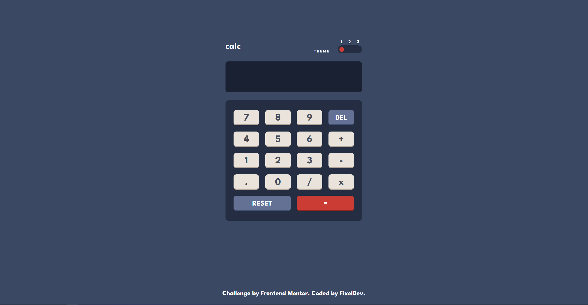
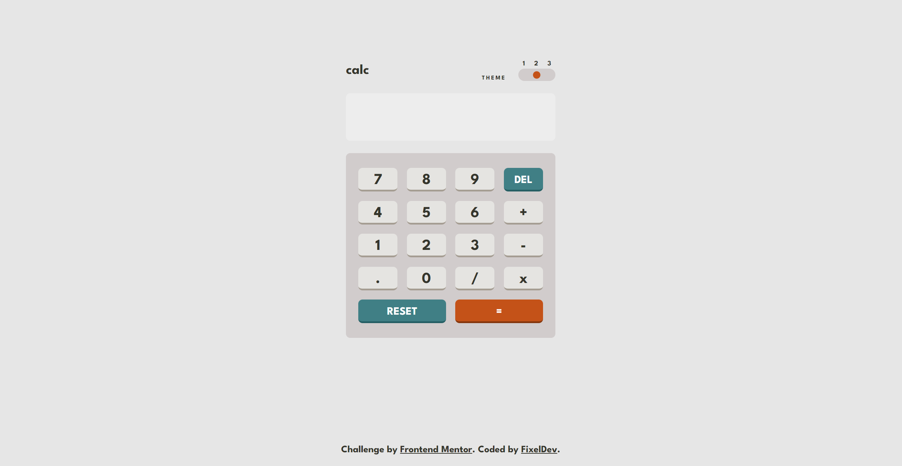
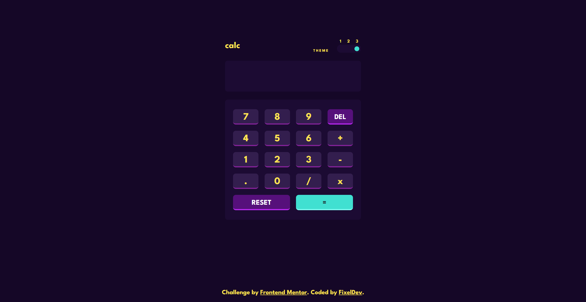

# Frontend Mentor - Calculator app solution

This is a solution to the [Calculator app challenge on Frontend Mentor](https://www.frontendmentor.io/challenges/calculator-app-9lteq5N29). Frontend Mentor challenges help you improve your coding skills by building realistic projects. 

## Overview

### The challenge

Users are able to:

- See the size of the elements adjust based on their device's screen size
- Perform mathmatical operations like addition, subtraction, multiplication, and division
- Adjust the color theme based on their preference

### Screenshot

### Default Theme

### Light Theme

### Dark Theme

### Links

- Solution URL: Add solution URL here](https://your-solution-url.com)
- Live Site URL: https://fixeldev.github.io/calculator-app-main/

### Built with

- Semantic HTML5 markup
- SCSS
- Flexbox
- CSS Grid
- JS library expr-eval https://github.com/silentmatt/expr-eval

### What I learned

- How to use external JS libraries
- How the try-catch block works
- Practised loops and maps in SCSS, which I used to create theme system

### Useful resources

- expr-eval: (https://github.com/silentmatt/expr-eval) - This is the JS library which handles parsing strings into math expressions.

## Author

- Frontend Mentor - @FixelDev(https://www.frontendmentor.io/profile/yourusername)
- Twitter - @FixelDev(https://www.twitter.com/yourusername)

**Note: Delete this note and add/remove/edit lines above based on what links you'd like to share.**

## Acknowledgments

This is where you can give a hat tip to anyone who helped you out on this project. Perhaps you worked in a team or got some inspiration from someone else's solution. This is the perfect place to give them some credit.

**Note: Delete this note and edit this section's content as necessary. If you completed this challenge by yourself, feel free to delete this section entirely.**
